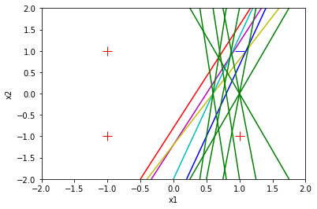

```python
# First element in vector x must be 1.
# Length of w and x must be n+1 for neuron with n inputs.

def compute_output (w, x):
        z= 0.0
        for i in range(len(w)):
            z += x[i]*w[i] #compute sum of weighted inputs
        if z < 0: #Apply sign function
                return -1
        else:
                return 1
            
```


```python
compute_output([0.9, -0.6, -0.5], [1.0, -1.0, -1.0])
```


    1


```python
compute_output([0.9, -0.6, -0.5], [1.0, -1.0, 1.0])
```


    1


```python
compute_output([0.9, -0.6, -0.5], [1.0, 1.0, -1.0])
```


    1


```python
compute_output([0.9, -0.6, -0.5], [1.0, 1.0, 1.0])
```


    -1


```python
import random

def show_learning(w):
    print('w0 =', '%5.2f' % w[0], ', w1 =', '%5.2f' % w[1], ', w2 =', '%5.2f' % w[2])
    
#Define variables needed to control training process.
random.seed(7) #To make repeatable
LEARNING_RATE = 0.1
index_list = [0,1,2,3] #Used to randomize order

#Define training examples.
x_train = [(1.0, -1.0, -1.0), (1.0, -1.0, 1.0), (1.0, 1.0, -1.0), (1.0, 1.0, 1.0)] #Inputs
y_train = [1.0, 1.0, 1.0, -1.0] #Output (ground truth)
            
#Define perceptron weights.
w=[0.2, -0.6, 0.25] #Initialize to some "random" numbers

#Print initial weights
show_learning(w)        
```

    w0 =  0.20 , w1 = -0.60 , w2 =  0.25
    


```python
#First element in vector x must be 1.
#Length of w and x must be n+1 for neuron with n inputs.

def compute_output(w, x):
        z=0.0
        for i in range(len(w)):
            z += x[i]*w[i] #Compute sum of weighted inputs
        if z<0: #Apply sign function
            return -1
        else:
            return 1
        
```


```python
#Perceptron training loop.
all_correct = False
while not all_correct:
    all_correct = True
    random.shuffle(index_list) #Randomize order
    for i in index_list:
        x = x_train[i]
        y = y_train[i]
        p_out = compute_output(w, x) #Perceptron function
        
        if y != p_out: #Update weights when wrong
            for j in range(0, len(w)):
                w[j] += (y * LEARNING_RATE * x[j])
                all_correct = False
                show_learning(w) #Show updated weights
```

    w0 =  0.30 , w1 = -0.60 , w2 =  0.25
    w0 =  0.30 , w1 = -0.50 , w2 =  0.25
    w0 =  0.30 , w1 = -0.50 , w2 =  0.15
    w0 =  0.40 , w1 = -0.50 , w2 =  0.15
    w0 =  0.40 , w1 = -0.40 , w2 =  0.15
    w0 =  0.40 , w1 = -0.40 , w2 =  0.05
    w0 =  0.30 , w1 = -0.40 , w2 =  0.05
    w0 =  0.30 , w1 = -0.50 , w2 =  0.05
    w0 =  0.30 , w1 = -0.50 , w2 = -0.05
    w0 =  0.40 , w1 = -0.50 , w2 = -0.05
    w0 =  0.40 , w1 = -0.40 , w2 = -0.05
    w0 =  0.40 , w1 = -0.40 , w2 = -0.15
    


```python
import matplotlib.pyplot as plt
import random

#Define variables needed for plotting.
color_list = ['r-', 'm-', 'y-', 'c-', 'b-', 'g-']
color_index = 0

def show_learning(w):
    global color_index
    print('w0 =', '%5.2f' % w[0], ', w1 =', '%5.2f' % w[1], ', w2 =', '%5.2f' % w[2])
    if color_index ==0:
        plt.plot([1.0], [1.0], 'b_', markersize=12)
        plt.plot([-1.0, 1.0, -1.0], [1.0, -1.0, -1.0], 'r+', markersize=12)
        plt.axis([-2, 2, -2, 2])
        plt.xlabel('x1')
        plt.ylabel('x2')
    x=[-2.0, 2.0]
    if abs(w[2]) < 1e-5:
        y=[-w[1]/(1e-5)*(-2.0)+(-w[0]/(1e-5)), -w[1]/(1e-5)*(2.0)+(-w[0]/(1e-5))]
    else:
        y=[-w[1]/w[2]*(-2.0)+(-w[0]/w[2]), -w[1]/w[2]*(2.0)+(-w[0]/w[2])]  
    plt.plot(x, y, color_list[color_index])
    if color_index < (len(color_list) - 1):
        color_index += 1
        
#Define variables needed to control training process.
random.seed(7) #To make repeatable
LEARNING_RATE = 0.1
index_list = [0,1,2,3] #Used to randomize order

#Define training examples.
x_train = [(1.0, -1.0, -1.0), (1.0, -1.0, 1.0), (1.0, 1.0, -1.0), (1.0, 1.0, 1.0)] #Inputs
y_train = [1.0, 1.0, 1.0, -1.0] #Output (ground truth)
            
#Define perceptron weights.
w=[0.2, -0.6, 0.25] #Initialize to some "random" numbers

#Print initial weights
show_learning(w)  

#First element in vector x must be 1.
#Length of w and x must be n+1 for neuron with n inputs.

def compute_output(w, x):
        z=0.0
        for i in range(len(w)):
            z += x[i]*w[i] #Compute sum of weighted inputs
        if z<0: #Apply sign function
            return -1
        else:
            return 1
        
#Perceptron training loop.
all_correct = False
while not all_correct:
    all_correct = True
    random.shuffle(index_list) #Randomize order
    for i in index_list:
        x = x_train[i]
        y = y_train[i]
        p_out = compute_output(w, x) #Perceptron function
        
        if y != p_out: #Update weights when wrong
            for j in range(0, len(w)):
                w[j] += (y * LEARNING_RATE * x[j])
                all_correct = False
                show_learning(w) #Show updated weights

```

    w0 =  0.20 , w1 = -0.60 , w2 =  0.25
    w0 =  0.30 , w1 = -0.60 , w2 =  0.25
    w0 =  0.30 , w1 = -0.50 , w2 =  0.25
    w0 =  0.30 , w1 = -0.50 , w2 =  0.15
    w0 =  0.40 , w1 = -0.50 , w2 =  0.15
    w0 =  0.40 , w1 = -0.40 , w2 =  0.15
    w0 =  0.40 , w1 = -0.40 , w2 =  0.05
    w0 =  0.30 , w1 = -0.40 , w2 =  0.05
    w0 =  0.30 , w1 = -0.50 , w2 =  0.05
    w0 =  0.30 , w1 = -0.50 , w2 = -0.05
    w0 =  0.40 , w1 = -0.50 , w2 = -0.05
    w0 =  0.40 , w1 = -0.40 , w2 = -0.05
    w0 =  0.40 , w1 = -0.40 , w2 = -0.15
    


    

    


```python
import numpy as np
def compute_output_vector(w, x):
    z = np.dot(w, x)
    return np.sign(z)
```


```python
for i in range(len(w)):
    w[i] += (y * LEARNING_RATE * x[i])
```


```python

```
